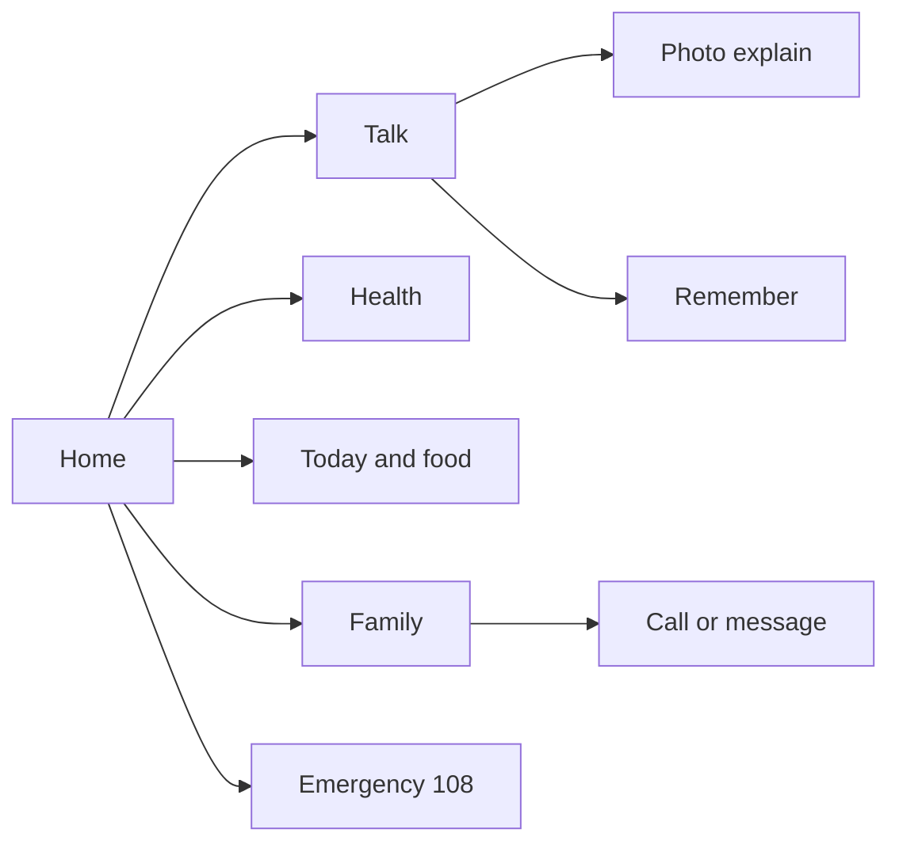
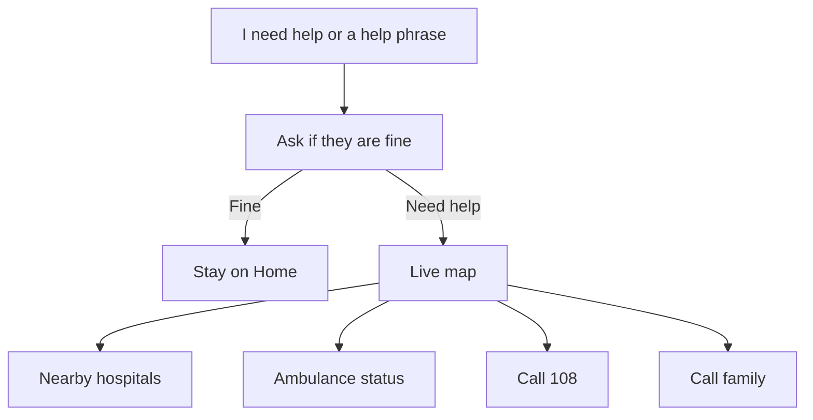
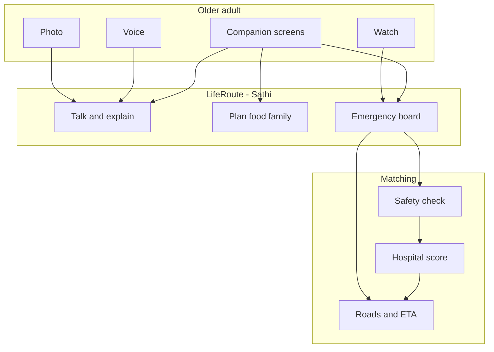
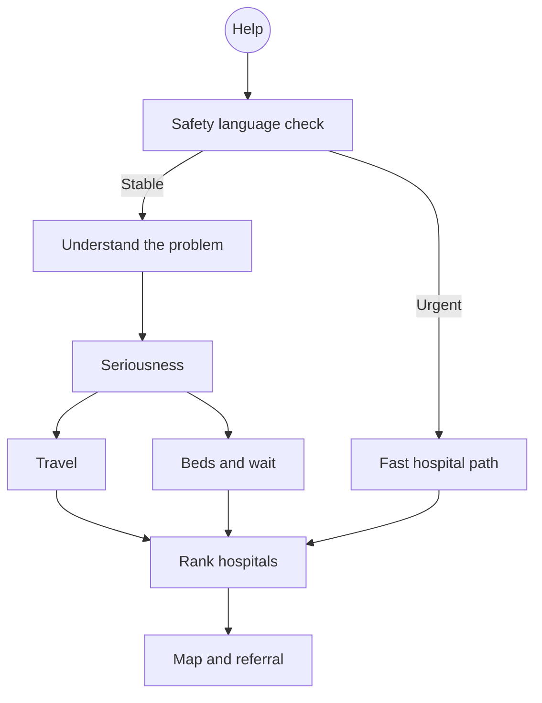

<div align="center">


<br/>

**LifeRoute - Sathi** is built for older people in India: large type, voice, simple words, family one tap away, and emergency help through **108** when something is wrong.

<br/>

<p align="center">
  
</p>

<br/>

[](https://python.org)
[](https://fastapi.tiangolo.com)
[](https://react.dev)
[](https://langchain-ai.github.io/langgraph/)
[](https://leafletjs.com)

[](LICENSE)
[](https://openrouter.ai)
[]()
[]()

</div>

---

## Table of contents

| # | Section |
|---|---------|
| 1 | [Who it is for](#who-it-is-for) |
| 2 | [Recent work](#recent-work) |
| 3 | [What older people can do](#what-older-people-can-do) |
| 4 | [Daily life](#daily-life) |
| 5 | [When help is needed](#when-help-is-needed) |
| 6 | [How a day works](#how-a-day-works) |
| 7 | [System architecture](#system-architecture) |
| 8 | [Hospital matching](#hospital-matching) |
| 9 | [Tech stack](#tech-stack) |
| 10 | [Quick start](#quick-start) |
| 11 | [Safety](#safety) |
| 12 | [License](#license) |

---

## Who it is for

LifeRoute - Sathi is made for **older adults**

Many apps ask seniors to read dense charts, hunt through menus, or fill a form while they are unwell. This product keeps one calm path:

- Speak or type in plain language
- See large buttons and short answers
- Call family without extra screens
- Tap **Emergency** and see nearby hospitals on a map
- Call **108** — the app never claims an ambulance was already sent

Trusted family can be added as contacts. Doctors still decide treatment. LifeRoute - Sathi prepares the next step.

---

## Recent work

These are the companion and emergency pieces added so older adults can use LifeRoute - Sathi as one product.

| Area | What we added |
|------|----------------|
| Talk | Chat like a normal conversation: your message first, then Sathi. Answers stream in. Chat stays after refresh. |
| Voice | Microphone on Home and Talk. If the model is down: **Model provider is busy. Please try again later.** |
| Photo explain | OCR + vision so a bill, letter, or medicine pack is explained in simple words. Same busy message if the model fails. |
| Today’s plan | “Book a meeting at 9 pm today” is saved on the plan. Personal bookings Sathi cannot do get a short no. |
| Home | Ask bar only. Chat bubbles stay on Talk. |
| Emergency | Live map of Noida / Gurugram hospitals. Incident progress steps every ~1.4s. A real road route draws when Routing starts. |
| Safety | Hidden rules and planning text are never shown in Talk. Talk and photo APIs need a session. |
| Deploy | SQLite is enough for a demo. Local secrets, databases, and caches stay out of git. Nearby hospital lists are cached so the live map does not recompute on every tick. |

Gen AI (all through **OpenRouter**, keys on the server only):

- Talk and daily answers — Gemini / Llama / GPT-4o-mini
- Voice transcript — Nemotron Omni
- Photo explain — vision models after OCR
- Emergency complaint and referral text — Nemotron Super  
Hospital ranking and **108** stay rule-based.

---

## What older people can do

| Need | What they get |
|------|----------------|
| Talk | Type or speak. Their message appears first. Sathi answers about what they said. |
| Today’s plan | Appointments, medicines, and reminders they already saved |
| Food | Everyday meal ideas from their own breakfast / lunch / dinner |
| Photo | A bill, letter, screen, or medicine pack explained in simple words |
| Health | Medicines, conditions, and vitals in large type — not a hospital workstation |
| Family | One tap to call. Messages wait for their confirmation |
| Memory | “Remember this” is saved and can be asked back later |
| Safety | Unusual watch readings ask if they are fine before help starts |
| Emergency | Live map, nearby hospitals, ambulance status, family calling, **call 108** |
| Settings | Name, city, and text size |

Personal booking (tickets, cabs, outside calendars) is not available. A meeting time they speak can be added to **today’s plan**.

---

## Daily life



**Talk** is a normal conversation: the older person’s line first, then Sathi’s reply. Chat stays on the device after refresh.

**Health** shows saved medicines and conditions. The full medical chart is optional and used when emergency help starts.

**Family** uses the phone dialer (`tel:`). Nothing is sent until they confirm.

---

## When help is needed

Emergency number is **108** (India).



On Emergency they see:

- Patient and location
- Incident progress (received → classified → ambulance → hospital → routing)
- A live road route to a capable hospital
- Coordination: 108 and family numbers

Hospitals on the map are around **Noida and Gurugram**, with travel time from the person’s location.

<p align="center">
  
</p>

---

## How a day works

```
┌──────────────────┬────────────────────────────────────────────────────┐
│ LifeRoute-Sathi  │  Companion for older adults · Emergency 108        │
├──────────────────┼────────────────────────────────────────────────────┤
│ Home             │  Greeting, ask bar, today’s plan, family, safety   │
│ Talk             │  Your message, then Sathi’s answer                 │
│ Health           │  Medicines and simple vitals                       │
│ Family           │  Call / confirm a message                          │
│ Food             │  Saved meals and everyday ideas                    │
│ Today’s plan     │  Appointments and reminders                        │
│ Show Sathi       │  Photo of a paper or screen                        │
│ Safety           │  Area, watch, unusual readings                     │
│ Emergency        │  Map, hospitals, route, 108                        │
└──────────────────┴────────────────────────────────────────────────────┘
```

---

## System architecture

<p align="center">
  
</p>



Details: [docs/ARCHITECTURE.md](docs/ARCHITECTURE.md), [docs/AI_ARCHITECTURE.md](docs/AI_ARCHITECTURE.md), [docs/EMERGENCY_FLOW.md](docs/EMERGENCY_FLOW.md).

---

## Hospital matching

When Emergency is open, a capable facility is suggested from travel time, wait, beds, specialty, and network — not “nearest pin only.”



| Stage | Meaning for the family |
|-------|------------------------|
| E1 / E2 | Live map, 108, family, nearby trauma-capable hospital |
| E3 | Urgent ER match |
| E4 / E5 | Clinic or self-care first |

This is a **navigation aid**, not a medical device. Staff at the hospital decide care.

---

## Tech stack

| Layer | Choice |
|-------|--------|
| Screens | React 19, Vite, React Router, Zustand |
| API | FastAPI, Pydantic, SQLAlchemy |
| Talk | OpenRouter (keys stay on the server) |
| Emergency map | Leaflet + public OSRM |
| Tests | pytest, Vitest |

---

## Quick start

Python ≥ 3.12, Node ≥ 18.

```bash
cp .env.example .env
# set LLM_API_KEY from https://openrouter.ai/keys

cd backend
python -m venv .venv
.venv\Scripts\activate
pip install -r requirements.txt
uvicorn main:app --reload --host 127.0.0.1 --port 8001

cd ../frontend
npm install
npm run dev -- --host 127.0.0.1 --port 5173
```

Open [http://127.0.0.1:5173](http://127.0.0.1:5173). API docs: [http://127.0.0.1:8001/docs](http://127.0.0.1:8001/docs).

```bash
cd backend && python -m pytest
cd frontend && npm test
```

Environment notes: [.env.example](.env.example) and [docs/DEPLOY_ENV.md](docs/DEPLOY_ENV.md). Never put `LLM_API_KEY` in the frontend.

| Variable | Purpose |
|----------|---------|
| `LLM_API_KEY` | OpenRouter |
| `LLM_MODEL` / `Voice_LLM` | Chat and transcription |
| `DATABASE_URL` | SQLite by default |
| `FRONTEND_URL` / `CORS_ORIGINS` | Browser origin |
| `VITE_API_URL` | Local API, e.g. `http://localhost:8001` |

---

## Safety

- Call **108** for an ambulance. The app prepares help; it does not dispatch a vehicle.
- Food and photo answers are everyday help, not a prescription or diagnosis.
- Family messages wait for confirmation.
- Wearable alerts ask the person first.
- Prompt text, keys, and other people’s data are not shown in Talk.

See [docs/SECURITY.md](docs/SECURITY.md) and [docs/TESTING.md](docs/TESTING.md).

---

## License

MIT
