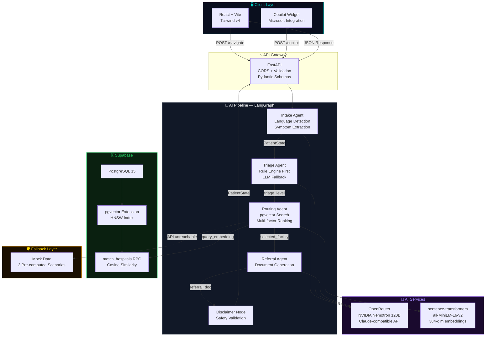
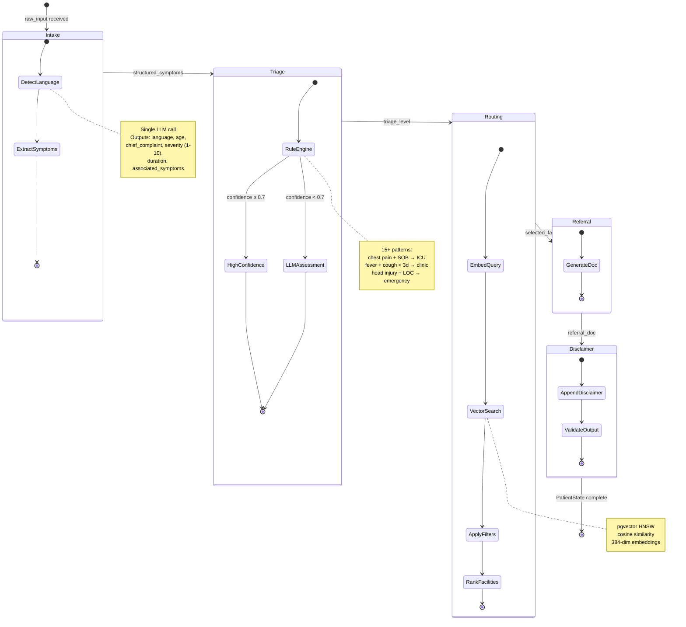
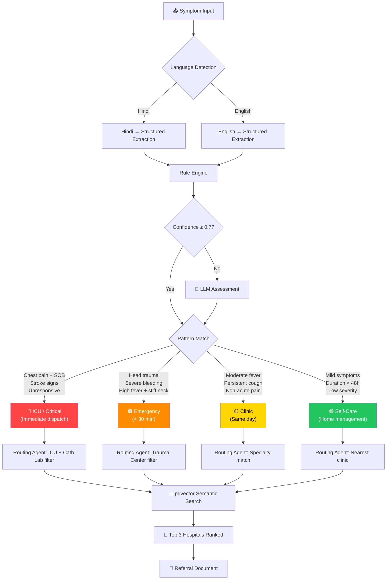
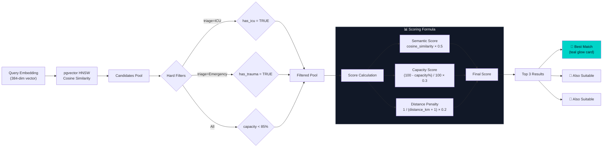
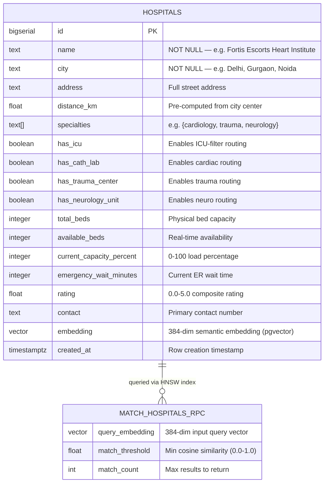
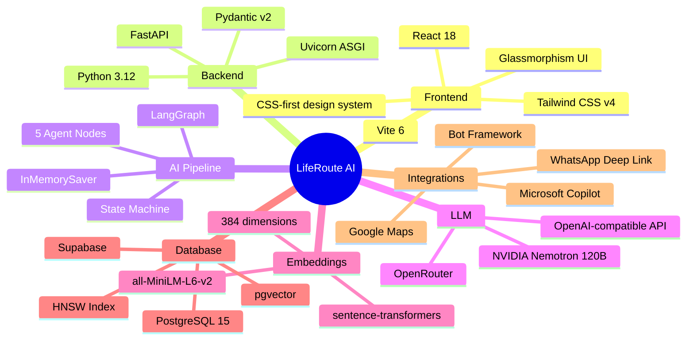

<div align="center">

<br/>

```
██╗     ██╗███████╗███████╗██████╗  ██████╗ ██╗   ██╗████████╗███████╗    █████╗ ██╗
██║     ██║██╔════╝██╔════╝██╔══██╗██╔═══██╗██║   ██║╚══██╔══╝██╔════╝   ██╔══██╗██║
██║     ██║█████╗  █████╗  ██████╔╝██║   ██║██║   ██║   ██║   █████╗     ███████║██║
██║     ██║██╔══╝  ██╔══╝  ██╔══██╗██║   ██║██║   ██║   ██║   ██╔══╝     ██╔══██║██║
███████╗██║██║     ███████╗██║  ██║╚██████╔╝╚██████╔╝   ██║   ███████╗   ██║  ██║██║
╚══════╝╚═╝╚═╝     ╚══════╝╚═╝  ╚═╝ ╚═════╝  ╚═════╝    ╚═╝   ╚══════╝   ╚═╝  ╚═╝╚═╝
```

### **Right Hospital. Right Time. Every Time.**

*Intelligent AI-powered healthcare navigation — triage symptoms, find the best-fit hospital, get referral docs instantly.*

<br/>

[](https://python.org)
[](https://fastapi.tiangolo.com)
[](https://react.dev)
[](https://vitejs.dev)
[](https://tailwindcss.com)
[](https://supabase.com)
[](https://langchain-ai.github.io/langgraph/)
[](https://copilot.microsoft.com)

<br/>

[](LICENSE)
[]()
[]()
[]()
[](https://github.com/pgvector/pgvector)
[]()

</div>

---

## 📋 Table of Contents

| # | Section | Description |
|---|---------|-------------|
| 1 | [🎯 Problem Statement](#-problem-statement) | Why LifeRoute AI exists |
| 2 | [✨ Key Features](#-key-features) | What makes it unique |
| 3 | [🏗️ System Architecture](#️-system-architecture) | High-level design |
| 4 | [🔄 Data Flow & Pipeline](#-data-flow--pipeline) | LangGraph agent flow |
| 5 | [🗄️ Database Schema](#️-database-schema) | Supabase + pgvector design |
| 6 | [🌐 API Reference](#-api-reference) | All endpoints documented |
| 7 | [💻 Tech Stack](#-tech-stack) | Every tool & why we chose it |
| 8 | [📁 Project Structure](#-project-structure) | Directory layout |
| 9 | [⚡ Quick Start](#-quick-start) | Get running in minutes |
| 10 | [🔧 Configuration](#-configuration) | Environment variables |
| 11 | [🧪 Testing & Demo Scenarios](#-testing--demo-scenarios) | Verification guide |
| 12 | [🛡️ Safety & Guardrails](#️-safety--guardrails) | Medical AI ethics |
| 13 | [🚀 Deployment](#-deployment) | Production setup |
| 14 | [🤝 Contributing](#-contributing) | How to contribute |

---

## 🎯 Problem Statement

<div align="center">

> **"Every year, thousands of patients in India reach hospitals that cannot treat them — not because hospitals don't exist, but because navigation is broken."**

</div>

### The Status Quo

```
Patient has emergency  →  Googles "nearest hospital"  →  Drives 10 minutes  →
Arrives at wrong facility  →  No ICU / No specialist  →  Transferred again  →
GOLDEN HOUR LOST
```

### What LifeRoute AI Fixes

| ❌ Old Way | ✅ LifeRoute AI |
|-----------|----------------|
| "Nearest hospital" | **Best-fit hospital for your condition** |
| Generic Google search | **AI triage + semantic specialty matching** |
| No language support | **English + Hindi natively** |
| No documentation | **Auto-generated referral letter** |
| Manual process | **< 10 seconds end-to-end** |
| Single data point | **ICU capacity + wait time + specialties + distance** |

---

## ✨ Key Features

<table>
<tr>
<td width="50%">

### 🧠 Intelligent Triage Engine
- **Rule-based first** — 15+ high-confidence symptom patterns (fast, deterministic)
- **LLM fallback** — NVIDIA Nemotron-3 Super 120B via OpenRouter when confidence < 0.7
- **4 urgency levels**: Self-Care → Clinic → Emergency → ICU
- Never states a diagnosis — uses "symptoms may suggest..." language

</td>
<td width="50%">

### 🏥 Smart Hospital Routing
- **pgvector semantic search** — HNSW index on specialty embeddings (384-dim)
- **Hard filters**: ICU availability, cath lab, trauma center, capacity < 85%
- **Multi-factor ranking**: semantic match × capacity score × distance penalty
- Returns top 3 with explicit rejection reasons for skipped hospitals

</td>
</tr>
<tr>
<td width="50%">

### 📄 Auto-Generated Referral Documents
- Structured markdown referral letter via LLM
- Includes: complaint summary, triage assessment, facility recommendation
- **Download as PDF** (browser print-to-PDF)
- **Share via WhatsApp** (wa.me deep link)

</td>
<td width="50%">

### 🤖 Microsoft Copilot Integration
- Floating Copilot widget on every page
- Same AI pipeline via `/copilot` endpoint
- Bot Framework-compatible response format
- Triage result + top hospital returned inline

</td>
</tr>
<tr>
<td width="50%">

### 🌐 Bilingual (EN + हिं)
- Language detection via LLM (first agent node)
- Hindi input → English extraction → Hindi response
- Language toggle on the intake UI
- No separate translation service needed

</td>
<td width="50%">

### 🛡️ Demo-Proof Fallback
- **Mock mode** with 3 pre-computed demo scenarios
- Activated when APIs are unreachable (hackathon WiFi issues)
- Frontend identical in live vs. mock mode
- Zero demo failures guaranteed

</td>
</tr>
</table>

---

## 🏗️ System Architecture

### High-Level Architecture



### Component Interaction Sequence

```mermaid
sequenceDiagram
    actor Patient
    participant Frontend as 🖥️ React Frontend
    participant API as ⚡ FastAPI
    participant Intake as 🔍 Intake Agent
    participant Triage as 🚦 Triage Agent
    participant Router as 🗺️ Routing Agent
    participant DB as 🗄️ Supabase pgvector
    participant LLM as 🤖 OpenRouter LLM
    participant Referral as 📄 Referral Agent

    Patient->>Frontend: Types symptoms (EN/हिं)
    Frontend->>Frontend: Show ProcessingSteps animation
    Frontend->>API: POST /navigate {input, location}
    API->>Intake: Invoke LangGraph pipeline

    rect rgb(20, 40, 80)
        Note over Intake,LLM: Step 1 — Intake (language + structured extraction)
        Intake->>LLM: Detect language, extract symptoms
        LLM-->>Intake: {language, chief_complaint, severity, age...}
    end

    rect rgb(40, 20, 20)
        Note over Triage,LLM: Step 2 — Triage (rule-first, LLM fallback)
        Triage->>Triage: Run 15 rule patterns
        alt Rule confidence ≥ 0.7
            Triage->>Triage: Return deterministic triage_level
        else Confidence < 0.7
            Triage->>LLM: Assess urgency
            LLM-->>Triage: triage_level + reasoning
        end
    end

    rect rgb(10, 40, 20)
        Note over Router,DB: Step 3 — Routing (semantic search + ranking)
        Router->>Router: Generate query embedding (384-dim)
        Router->>DB: match_hospitals RPC (cosine similarity)
        DB-->>Router: Top candidates + similarity scores
        Router->>Router: Apply filters (ICU/cath/capacity)
        Router->>Router: Rank by match × capacity × distance
    end

    rect rgb(40, 10, 40)
        Note over Referral,LLM: Step 4 — Referral document generation
        Referral->>LLM: Generate structured referral letter
        LLM-->>Referral: Formatted markdown document
    end

    API-->>Frontend: Full PatientState JSON
    Frontend->>Frontend: Render TriageCard + HospitalCards
    Patient->>Frontend: Clicks "Download Referral"
    Frontend->>Patient: PDF download / WhatsApp share
```



---

## 🔄 Data Flow & Pipeline

### LangGraph State Machine



### Triage Decision Logic



### Hospital Ranking Algorithm



---

## 🗄️ Database Schema

### Entity Relationship Diagram



### pgvector Index Architecture

```
hospitals table
│
├── id (BIGSERIAL PRIMARY KEY)
├── name, city, address ... (text fields)
├── has_icu, has_cath_lab, has_trauma_center (boolean filters)
├── total_beds, available_beds, current_capacity_percent (capacity)
├── rating, emergency_wait_minutes (ranking signals)
│
└── embedding VECTOR(384)        ← all-MiniLM-L6-v2 embedding
         │
         └── HNSW INDEX (vector_cosine_ops)
                  │
                  ├── m = 16  (max connections per layer)
                  ├── ef_construction = 64
                  └── Cosine similarity: 1 - (h.embedding <=> query_embedding)
```

### SQL Schema Highlights

```sql
-- Enable pgvector extension
CREATE EXTENSION IF NOT EXISTS vector;

-- Hospitals table with vector column
CREATE TABLE hospitals (
    id                        BIGSERIAL PRIMARY KEY,
    specialties               TEXT[],           -- array type for multi-specialty
    embedding                 VECTOR(384),      -- pgvector column
    current_capacity_percent  INTEGER           -- used in routing filter
);

-- HNSW index for fast approximate nearest neighbour search
CREATE INDEX hospitals_embedding_idx
    ON hospitals USING hnsw (embedding vector_cosine_ops);

-- Semantic search RPC function (called from Python)
CREATE OR REPLACE FUNCTION match_hospitals(
    query_embedding  VECTOR(384),
    match_threshold  FLOAT,
    match_count      INT
)
RETURNS TABLE (..., similarity FLOAT)
LANGUAGE plpgsql AS $$
BEGIN
    RETURN QUERY
    SELECT ...,
           1 - (h.embedding <=> query_embedding) AS similarity
    FROM hospitals h
    WHERE h.embedding IS NOT NULL
      AND 1 - (h.embedding <=> query_embedding) > match_threshold
    ORDER BY h.embedding <=> query_embedding
    LIMIT match_count;
END;
$$;
```

---

## 🌐 API Reference

### Base URL

```
Development:   http://localhost:8000
Production:    https://your-deploy-url.com
```

### Endpoints

<table>
<thead>
<tr>
<th>Method</th>
<th>Endpoint</th>
<th>Description</th>
<th>Auth</th>
</tr>
</thead>
<tbody>
<tr>
<td></td>
<td><code>/navigate</code></td>
<td>Main AI pipeline — triage + route + referral</td>
<td>None</td>
</tr>
<tr>
<td></td>
<td><code>/copilot</code></td>
<td>Microsoft Copilot connector (Bot Framework format)</td>
<td>None</td>
</tr>
<tr>
<td></td>
<td><code>/hospitals</code></td>
<td>All hospital records (for map view)</td>
<td>None</td>
</tr>
<tr>
<td></td>
<td><code>/health</code></td>
<td>Health check + dependency status</td>
<td>None</td>
</tr>
</tbody>
</table>

### `POST /navigate` — Main Pipeline

**Request Body**
```json
{
  "input": "I have severe chest pain and difficulty breathing",
  "location": {
    "lat": 28.6139,
    "lng": 77.2090
  }
}
```

**Response Body** (full `PatientState`)
```json
{
  "raw_input": "I have severe chest pain and difficulty breathing",
  "language": "en",
  "structured_symptoms": {
    "chief_complaint": "chest pain",
    "severity": 9,
    "duration": "sudden onset",
    "associated_symptoms": ["shortness of breath", "sweating"],
    "age": null,
    "gender": null
  },
  "triage_level": "icu",
  "triage_reasoning": "Symptoms may suggest a cardiac event. Immediate specialist care recommended.",
  "matched_facilities": [
    {
      "name": "Fortis Escorts Heart Institute",
      "city": "Delhi",
      "distance_km": 6.5,
      "has_icu": true,
      "has_cath_lab": true,
      "available_beds": 55,
      "emergency_wait_minutes": 10,
      "rating": 4.6,
      "contact": "+91-11-47135000",
      "similarity": 0.94
    }
  ],
  "selected_facility": { "...": "top ranked hospital" },
  "routing_reason": "Selected for cath lab availability, ICU capacity, and highest cardiac specialty match score.",
  "referral_doc": "# Referral Document\n\n**Patient Complaint:** ...",
  "disclaimer": "⚠️ This is an AI-assisted navigation tool..."
}
```

**Triage Level Reference**

| Level | Value | Color | Action |
|-------|-------|-------|--------|
| ICU / Critical | `icu` | 🔴 Red | Immediate emergency dispatch |
| Emergency | `emergency` | 🟠 Orange | ER within 30 minutes |
| Clinic | `clinic` | 🟡 Yellow | Same-day doctor visit |
| Self-Care | `self-care` | 🟢 Green | Home management with guidance |

### `POST /copilot` — Copilot Connector

**Request** (Bot Framework Activity format)
```json
{
  "type": "message",
  "text": "मुझे तेज़ बुखार और सिरदर्द है",
  "from": { "id": "user1" },
  "conversation": { "id": "conv1" }
}
```

**Response**
```json
{
  "type": "message",
  "text": "🚦 Urgency: Clinic\n\n🏥 Recommended: Max Super Speciality Hospital\n\n📍 7.1 km away | ⏱ 12 min wait",
  "triage_level": "clinic",
  "top_hospital": { "...": "hospital object" }
}
```

---

## 💻 Tech Stack

### Complete Technology Map



### Detailed Tech Stack

#### 🎨 Frontend

| Technology | Version | Purpose |
|-----------|---------|---------|
| **React** | 18 | UI component library with hooks |
| **Vite** | 6 | Ultra-fast build tool + HMR |
| **Tailwind CSS** | v4 | CSS-first utility framework (no config file) |
| **Inter Font** | — | Primary typeface (Google Fonts) |
| **CSS Custom Properties** | — | Design tokens (`--color-teal`, `--color-navy`) |
| **CSS Animations** | — | Pulse rings, staggered steps, slide-ins |
| **Glassmorphism** | — | `backdrop-blur` + semi-transparent cards |

**Frontend Component Architecture**

```
src/
├── App.jsx                  # Root — Google Fonts + CopilotWidget overlay
├── pages/
│   └── Home.jsx             # State machine: idle → loading → results
├── components/
│   ├── IntakeBar.jsx        # Hero symptom input + quick-select tiles
│   ├── ProcessingSteps.jsx  # 4-step animated progress tracker
│   ├── TriageCard.jsx       # Color-coded urgency banner
│   ├── HospitalCard.jsx     # Hero UI — capabilities, directions, call
│   ├── ReferralPanel.jsx    # Slide-in panel + PDF + WhatsApp share
│   ├── CopilotWidget.jsx    # Floating Copilot chat drawer
│   ├── HospitalMap.jsx      # Map view component
│   ├── Navbar.jsx           # Navigation bar
│   └── Footer.jsx           # Footer
└── index.css                # Design system (@theme tokens)
```

**Design System Color Palette**

| Token | Hex | Usage |
|-------|-----|-------|
| `--color-navy` | `#0A0F1E` | Background |
| `--color-navy-light` | `#111827` | Card backgrounds |
| `--color-navy-card` | `#1A1F35` | Elevated cards |
| `--color-teal` | `#00D4C8` | Primary accent, CTA, best match glow |
| `--color-critical` | `#FF4444` | ICU triage level |
| `--color-emergency` | `#FF8C00` | Emergency triage level |
| `--color-warning` | `#FFD700` | Clinic triage level |
| `--color-safe` | `#22C55E` | Self-care triage level |

---

#### ⚡ Backend

| Technology | Version | Purpose |
|-----------|---------|---------|
| **FastAPI** | 0.115 | Async REST API framework |
| **Python** | 3.12 | Runtime language |
| **Pydantic** | v2 | Request/response validation + serialization |
| **Uvicorn** | Standard | ASGI server with WebSocket support |
| **python-dotenv** | — | Environment variable loading |

---

#### 🧠 AI / LLM

| Technology | Model | Purpose |
|-----------|-------|---------|
| **OpenRouter** | Gateway | OpenAI-compatible API routing |
| **NVIDIA Nemotron-3 Super 120B** | `nvidia/nemotron-3-super-120b-a12b:free` | Primary LLM for triage + referral |
| **sentence-transformers** | `all-MiniLM-L6-v2` | Hospital specialty embeddings (384-dim) |
| **LangGraph** | Latest | Agentic state machine pipeline |
| **langchain-anthropic** | — | LLM interface compatibility layer |

**Why NVIDIA Nemotron via OpenRouter?**
- Free tier available during hackathon
- 120B parameters — strong reasoning capability
- OpenAI-compatible API (drop-in for Claude/GPT)
- Excellent at structured JSON extraction

---

#### 🗄️ Database

| Technology | Version | Purpose |
|-----------|---------|---------|
| **Supabase** | Cloud | Managed PostgreSQL + REST API |
| **PostgreSQL** | 15 | Primary database |
| **pgvector** | 0.7 | Vector similarity extension |
| **HNSW Index** | — | Approximate nearest-neighbor search |
| **supabase-py** | — | Python client SDK |

**Why pgvector over Pinecone/Weaviate?**
- Runs inside existing PostgreSQL (no extra service)
- HNSW index gives sub-millisecond approximate NN search
- SQL joins with boolean filters (`has_icu AND capacity < 85%`)
- Supabase free tier sufficient for hackathon

---

#### 🤖 Microsoft Copilot Integration

| Component | Technology |
|-----------|-----------|
| Copilot Widget UI | Custom React component |
| API Endpoint | `POST /copilot` |
| Protocol | Bot Framework Activity format |
| Response format | Bot Framework message + custom fields |
| Branding | Microsoft Copilot logo + teal accent |

---

## 📁 Project Structure

```
liferoute-ai/
│
├── 📄 README.md                    ← You are here
├── 📄 .env.example                 ← Copy → .env and fill values
├── 📄 .gitignore
│
├── 🐍 backend/
│   ├── 📄 main.py                  ← FastAPI application + 4 endpoints
│   ├── 📄 requirements.txt         ← Python dependencies
│   │
│   ├── graph/
│   │   ├── 📄 state.py             ← PatientState TypedDict (shared pipeline state)
│   │   ├── 📄 pipeline.py          ← LangGraph wiring: Intake→Triage→Routing→Referral→Disclaimer
│   │   ├── 📄 mock_data.py         ← 3 pre-computed demo scenarios (offline fallback)
│   │   │
│   │   └── agents/
│   │       ├── 📄 intake.py        ← Language detection + structured symptom extraction
│   │       ├── 📄 triage.py        ← Rule engine (15 patterns) + LLM fallback
│   │       ├── 📄 routing.py       ← pgvector search + multi-factor ranking
│   │       ├── 📄 referral.py      ← LLM referral document generation
│   │       └── 📄 disclaimer.py    ← Deterministic safety node (no LLM call)
│   │
│   ├── models/
│   │   └── 📄 schemas.py           ← Pydantic models: NavigateRequest/Response, HospitalRecord
│   │
│   └── db/
│       ├── 📄 supabase_client.py   ← Supabase client + search_hospitals() + mock fallback
│       ├── 📄 init_supabase.sql    ← One-click SQL migration (paste into Supabase SQL Editor)
│       └── 📄 seed_hospitals.py    ← Seeds 15 Delhi/Noida/Gurgaon hospitals + generates embeddings
│
└── ⚛️ frontend/
    ├── 📄 package.json
    ├── 📄 vite.config.js
    │
    └── src/
        ├── 📄 App.jsx              ← Root: Inter font + CopilotWidget overlay
        ├── 📄 main.jsx
        ├── 📄 index.css            ← Design system: @theme tokens + keyframes
        │
        ├── pages/
        │   ├── 📄 Home.jsx         ← State machine: idle → loading → results
        │   └── 📄 LifeRoutePage.jsx
        │
        └── components/
            ├── 📄 IntakeBar.jsx    ← Hero input + 3 emergency quick-select tiles + EN/हिं toggle
            ├── 📄 ProcessingSteps.jsx ← 4-step animated progress tracker
            ├── 📄 TriageCard.jsx   ← Color-coded urgency banner + reasoning
            ├── 📄 HospitalCard.jsx ← Hero card: capabilities, beds, wait, directions, call
            ├── 📄 ReferralPanel.jsx ← Slide-in panel + PDF download + WhatsApp share
            ├── 📄 CopilotWidget.jsx ← Floating Copilot chat drawer
            ├── 📄 HospitalMap.jsx  ← Map view
            ├── 📄 Navbar.jsx
            ├── 📄 Footer.jsx
            └── 📄 BackgroundLayer.jsx ← Animated gradient background
```

---

## ⚡ Quick Start

### Prerequisites

| Requirement | Version | Check |
|------------|---------|-------|
| Python | ≥ 3.12 | `python --version` |
| Node.js | ≥ 18 | `node --version` |
| npm | ≥ 9 | `npm --version` |
| Supabase account | Free tier OK | [supabase.com](https://supabase.com) |
| OpenRouter account | Free tier OK | [openrouter.ai](https://openrouter.ai) |

---

### Step 1 — Clone & Configure

```bash
git clone https://github.com/your-org/liferoute-ai.git
cd liferoute-ai

# Copy environment template
cp .env.example .env
```

Fill in `.env` (see [Configuration](#-configuration) section):
```env
OPENROUTER_API_KEY=sk-or-v1-...
SUPABASE_URL=https://your-project.supabase.co
SUPABASE_KEY=eyJ...
```

---

### Step 2 — Supabase Database Setup

1. Go to **[supabase.com](https://supabase.com)** → your project → **SQL Editor**
2. Paste the entire contents of `backend/db/init_supabase.sql`
3. Click **Run** — this creates the table, HNSW index, and RPC function

```bash
# Then seed 15 hospitals with embeddings
cd backend
python -m venv .venv
.venv\Scripts\activate        # Windows
# source .venv/bin/activate   # Mac/Linux
pip install -r requirements.txt
python db/seed_hospitals.py
```

---

### Step 3 — Start the Backend

```bash
cd backend
uvicorn main:app --reload --port 8000
```

Verify:
```bash
curl http://localhost:8000/health
# → {"status": "ok", "supabase": "connected", "llm": "ready"}
```

---

### Step 4 — Start the Frontend

```bash
cd frontend
npm install
npm run dev
# → http://localhost:5173
```

---

### Step 5 — Test the Pipeline

```bash
# English emergency scenario
curl -X POST http://localhost:8000/navigate \
  -H "Content-Type: application/json" \
  -d '{"input": "I have severe chest pain and shortness of breath", "location": {"lat": 28.6139, "lng": 77.2090}}'

# Hindi scenario
curl -X POST http://localhost:8000/navigate \
  -H "Content-Type: application/json" \
  -d '{"input": "मुझे तेज़ बुखार और सिरदर्द है", "location": {"lat": 28.6139, "lng": 77.2090}}'

# Trauma scenario
curl -X POST http://localhost:8000/navigate \
  -H "Content-Type: application/json" \
  -d '{"input": "Road accident, head injury, bleeding from head", "location": {"lat": 28.6139, "lng": 77.2090}}'
```

---

## 🔧 Configuration

### Environment Variables Reference

| Variable | Required | Example | Description |
|---------|----------|---------|-------------|
| `OPENROUTER_API_KEY` | ✅ Yes | `sk-or-v1-...` | OpenRouter API key ([get here](https://openrouter.ai/keys)) |
| `OPENROUTER_BASE_URL` | ✅ Yes | `https://openrouter.ai/api/v1` | OpenRouter base URL |
| `OPENROUTER_MODEL` | ✅ Yes | `nvidia/nemotron-3-super-120b-a12b:free` | LLM model slug |
| `OPENROUTER_HTTP_REFERER` | Optional | `http://localhost:5173` | Shown in OpenRouter dashboard |
| `OPENROUTER_APP_NAME` | Optional | `LifeRoute AI` | App attribution label |
| `SUPABASE_URL` | ✅ Yes | `https://abc.supabase.co` | Project URL (NOT /rest/v1/) |
| `SUPABASE_KEY` | ✅ Yes | `eyJ...` | Service role key (from Settings → API) |
| `MOCK_MODE` | Optional | `false` | `true` = skip all LLM/DB calls |
| `FRONTEND_URL` | Optional | `http://localhost:5173` | CORS origin |
| `VITE_API_URL` | Optional | `http://localhost:8000` | Frontend → backend URL |

> **⚠️ Security Note:** Never commit your `.env` file. The `.gitignore` already excludes it. The `SUPABASE_KEY` is a service role key — treat it like a password.

---

## 🧪 Testing & Demo Scenarios

### Three Production Demo Scenarios

| # | Input | Expected Triage | Expected Hospital | Language |
|---|-------|----------------|-------------------|----------|
| 1 | `"I have severe chest pain and difficulty breathing"` | 🔴 ICU | Fortis Escorts Heart Institute | English |
| 2 | `"मुझे तेज़ बुखार और सिरदर्द है"` | 🟡 Clinic | Max Super Speciality Hospital | Hindi |
| 3 | `"Road accident, head injury, bleeding"` | 🟠 Emergency | AIIMS Trauma Centre | English |

### Verification Checklist

```bash
# ✅ Backend health
curl http://localhost:8000/health

# ✅ Hospital listing
curl http://localhost:8000/hospitals | python -m json.tool | head -50

# ✅ Full pipeline (chest pain)
curl -X POST http://localhost:8000/navigate \
  -H "Content-Type: application/json" \
  -d '{"input":"chest pain shortness of breath","location":{"lat":28.6139,"lng":77.2090}}'

# ✅ Mock mode (no API keys needed)
MOCK_MODE=true uvicorn main:app --reload
```

### Manual UI Verification

- [ ] Symptom input → shows ProcessingSteps animation
- [ ] Triage card renders with correct color (red/orange/yellow/green)
- [ ] Hospital cards rank Best Match first (teal glow)
- [ ] "Why this hospital?" section expands
- [ ] "Get Directions" opens Google Maps
- [ ] "Call Hospital" triggers `tel:` link
- [ ] Referral panel slides in from right
- [ ] PDF download triggers browser print dialog
- [ ] WhatsApp share opens wa.me link
- [ ] Copilot widget opens/closes smoothly
- [ ] Hindi input detected and response matches language
- [ ] Mobile viewport (375px) renders correctly

---

## 🛡️ Safety & Guardrails

LifeRoute AI is built with medical AI ethics as a first-class concern:

### What LifeRoute AI Will NEVER Do

```
❌  State a diagnosis  →  "You have a heart attack"
❌  Prescribe medication
❌  Claim to replace a doctor
❌  Guarantee triage accuracy
```

### What LifeRoute AI Always Does

```
✅  Use qualified language: "symptoms may suggest...", "consistent with..."
✅  Append medical disclaimer to every response
✅  Validate outputs contain no diagnosis-like statements (disclaimer.py)
✅  Recommend calling emergency services for critical triage levels
✅  Display "AI-assisted navigation tool — always consult a doctor"
```

### Disclaimer (appended to every response)

> ⚠️ **Medical Disclaimer:** This is an AI-assisted hospital navigation tool, not a medical device. Triage assessments are indicative only and do not constitute a medical diagnosis. Always consult a qualified healthcare professional. In life-threatening emergencies, call **112** immediately.

---

## 🚀 Deployment

### Docker Compose (Recommended)

```yaml
version: '3.9'

services:
  backend:
    build: ./backend
    ports:
      - "8000:8000"
    env_file: .env
    command: uvicorn main:app --host 0.0.0.0 --port 8000

  frontend:
    build: ./frontend
    ports:
      - "3000:80"
    environment:
      - VITE_API_URL=http://backend:8000
    depends_on:
      - backend
```

### Backend `Dockerfile`

```dockerfile
FROM python:3.12-slim
WORKDIR /app
COPY requirements.txt .
RUN pip install --no-cache-dir -r requirements.txt
COPY . .
EXPOSE 8000
CMD ["uvicorn", "main:app", "--host", "0.0.0.0", "--port", "8000"]
```

### Frontend `Dockerfile`

```dockerfile
FROM node:18-alpine AS builder
WORKDIR /app
COPY package*.json .
RUN npm ci
COPY . .
RUN npm run build

FROM nginx:alpine
COPY --from=builder /app/dist /usr/share/nginx/html
EXPOSE 80
```

### Production Environment Checklist

- [ ] Set `MOCK_MODE=false`
- [ ] Use `SUPABASE_KEY` with RLS policies enabled
- [ ] Set `FRONTEND_URL` to production domain for CORS
- [ ] Configure HTTPS (Cloudflare / Nginx reverse proxy)
- [ ] Set `VITE_API_URL` to production backend URL
- [ ] Run database migrations via `init_supabase.sql`
- [ ] Seed hospitals with `python db/seed_hospitals.py`

---

## 🤝 Contributing

### Development Workflow

```bash
# 1. Fork and clone
git clone https://github.com/your-username/liferoute-ai.git

# 2. Create feature branch
git checkout -b feature/your-feature-name

# 3. Make changes — backend
cd backend
pip install -r requirements.txt
uvicorn main:app --reload

# 4. Make changes — frontend
cd frontend
npm install && npm run dev

# 5. Commit with conventional commits
git commit -m "feat(routing): add distance penalty to ranking algorithm"
git commit -m "fix(triage): correct Hindi detection edge case"
git commit -m "docs(readme): update API reference"

# 6. Push and open PR
git push origin feature/your-feature-name
```

### Commit Message Convention

| Prefix | Use for |
|--------|---------|
| `feat` | New feature |
| `fix` | Bug fix |
| `docs` | Documentation only |
| `refactor` | Code change without feature/fix |
| `perf` | Performance improvement |
| `test` | Adding tests |
| `chore` | Build/tooling changes |

---

## 📊 Performance Benchmarks

| Metric | Value | Notes |
|--------|-------|-------|
| **End-to-end latency** | < 3s | Intake + Triage + Routing + Referral |
| **pgvector HNSW query** | < 5ms | 384-dim, 15 hospitals |
| **Rule engine triage** | < 1ms | Deterministic, no LLM call |
| **LLM call (Nemotron 120B)** | ~1.5s | Via OpenRouter |
| **Embedding generation** | ~50ms | all-MiniLM-L6-v2, CPU |
| **Frontend bundle size** | < 500KB | Vite tree-shaking |
| **Time to First Byte** | < 200ms | FastAPI async |

---

## 📜 License

```
MIT License

Copyright (c) 2026 LifeRoute AI Team

Permission is hereby granted, free of charge, to any person obtaining a copy
of this software and associated documentation files (the "Software"), to deal
in the Software without restriction, including without limitation the rights
to use, copy, modify, merge, publish, distribute, sublicense, and/or sell
copies of the Software, and to permit persons to whom the Software is
furnished to do so, subject to the following conditions:

The above copyright notice and this permission notice shall be included in all
copies or substantial portions of the Software.

THE SOFTWARE IS PROVIDED "AS IS", WITHOUT WARRANTY OF ANY KIND, EXPRESS OR
IMPLIED, INCLUDING BUT NOT LIMITED TO THE WARRANTIES OF MERCHANTABILITY,
FITNESS FOR A PARTICULAR PURPOSE AND NONINFRINGEMENT.
```

<sub>Built with ❤️ for better healthcare navigation in India</sub>

<sub><b>⚕️ LifeRoute AI — Right Hospital. Right Time. Every Time.</b></sub>

</div>
