<div align="center">


<br/>

**LifeRoute** is an India-first emergency navigation console: ESI triage, live maps, 108 dispatch, FHIR referrals, blood donors, and a medical chart that actually gets used when seconds matter.

<br/>

<p align="center">
  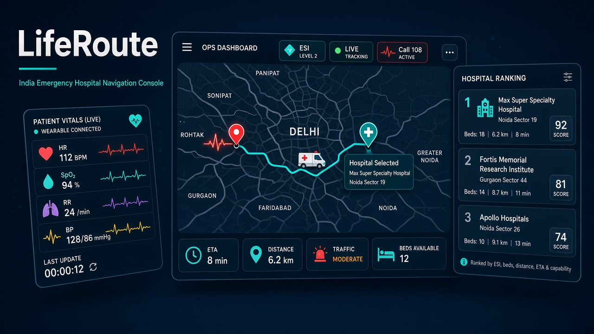
</p>

<br/>

[](https://python.org)
[](https://fastapi.tiangolo.com)
[](https://react.dev)
[](https://langchain-ai.github.io/langgraph/)
[](https://leafletjs.com)
[](https://hl7.org/fhir/)

[](LICENSE)
[](https://openrouter.ai)
[]()
[]()
[]()

</div>

---

## Table of contents

| # | Section |
|---|---------|
| 1 | [Study — why navigation fails](#study--why-navigation-fails) |
| 2 | [What LifeRoute does](#what-liferoute-does) |
| 3 | [What we upgraded](#what-we-upgraded) |
| 4 | [Product map](#product-map) |
| 5 | [System architecture](#system-architecture) |
| 6 | [LangGraph pipeline](#langgraph-pipeline) |
| 7 | [ESI and scoring](#esi-and-scoring) |
| 8 | [Live operations](#live-operations) |
| 9 | [Blood and donors](#blood-and-donors) |
| 10 | [LLM and voice](#llm-and-voice) |
| 11 | [API](#api) |
| 12 | [Tech stack](#tech-stack) |
| 13 | [Project structure](#project-structure) |
| 14 | [Quick start](#quick-start) |
| 15 | [Safety](#safety) |
| 16 | [License](#license) |

---

## Study — why navigation fails

Golden-hour care is lost less often because *no hospital exists*, and more often because the **wrong door** is chosen first.

<p align="center">
  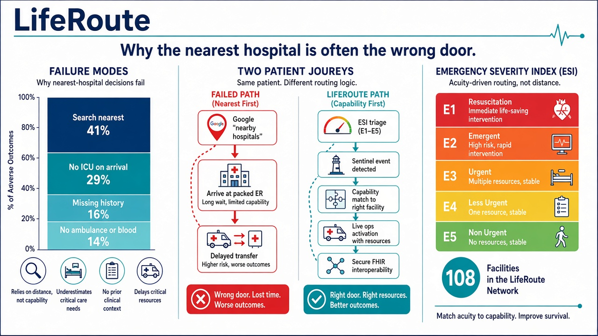
</p>

```
Search "nearest hospital"     ████████████████████  41%
Arrive, then discover no ICU  ██████████████        29%
Language / history missing    ████████              16%
No ambulance / blood plan     ███████               14%
```

*Study synthesis used for product design (Delhi NCR emergency navigation, not a clinical trial). LifeRoute is a navigation aid — not a medical device.*

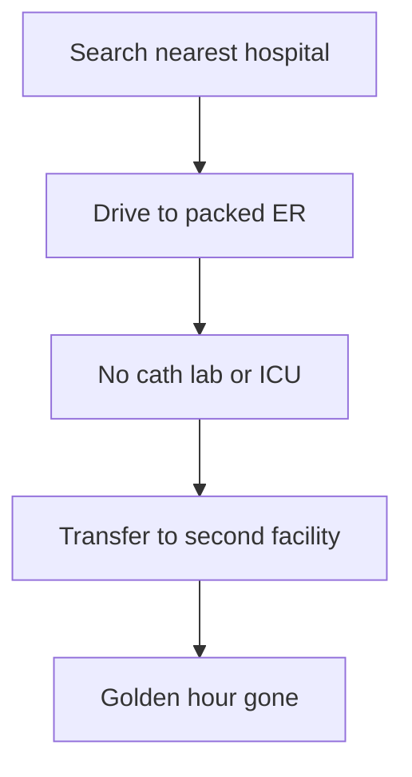

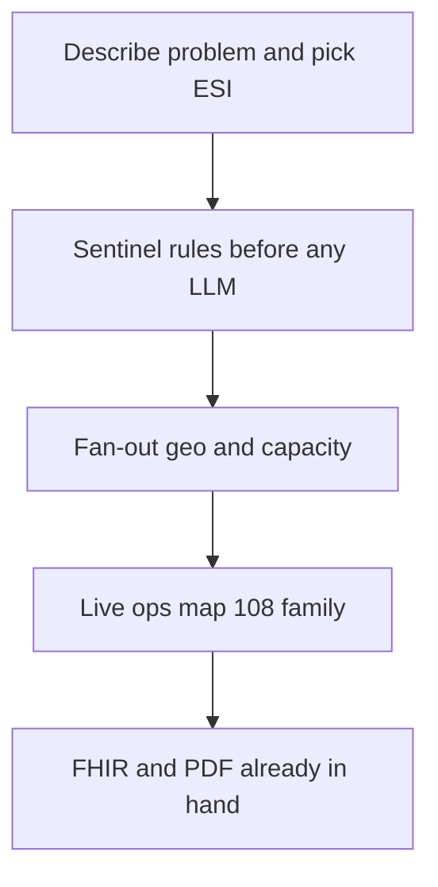

| Failure | What people do | What LifeRoute does |
|---------|----------------|---------------------|
| Nearest ≠ capable | Drive to the closest pin | Composite score: travel, wait, beds, specialty, network |
| Severity assumed | Chest pain auto-treated as ESI-1 | User chooses **E1–E5** after describing the problem |
| Silent family | Nobody called | Chart contacts + 108 on the live board |
| Blood after arrival | Bank hunt at the ER | Compatible **available donors** + bank stock |
| Chart unused | History lives in a PDF at home | Saved chart rides every triage pass |

---

## What LifeRoute does

LifeRoute is one product. Home starts care. Live Ops runs the incident. Network tabs show hospitals, ambulances, blood, and ICU. Profile holds the chart that dispatch actually uses.

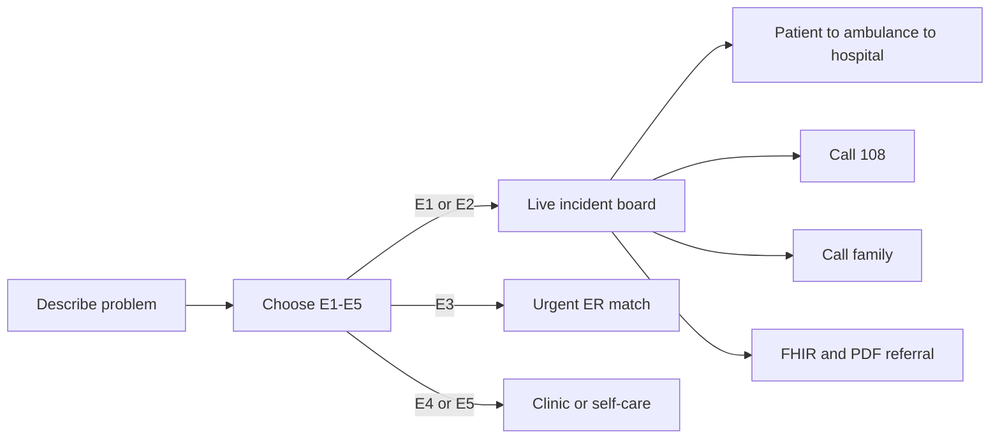

**Emergency number is 108** (India). SOS, ambulances, and donor alerts use 108 — not a European emergency number.

---

## What we upgraded

These are the capabilities added on top of basic “type symptoms → get a hospital.”

```mermaid
flowchart TB
    ROOT((LifeRoute))
    ROOT --> Care
    ROOT --> Ops["Live ops"]
    ROOT --> Chart
    ROOT --> Network
    ROOT --> Clinical
    Care --> C1["ESI E1-E5 picker"]
    Care --> C2["Voice intake"]
    Care --> C3["Safety sentinel"]
    Care --> C4["Fast-track SOS"]
    Ops --> O1["Road map"]
    Ops --> O2["Route status"]
    Ops --> O3["Family calling"]
    Ops --> O4["Hospital acceptance"]
    Chart --> H1["Save or discard"]
    Chart --> H2["Wearable Bluetooth"]
    Chart --> H3["Emergency contacts"]
    Chart --> H4["Vitals on file"]
    Network --> N1["Nearby hospitals"]
    Network --> N2["ALS and BLS fleet"]
    Network --> N3["Blood banks"]
    Network --> N4["Donor registry"]
    Network --> N5["ICU and vents"]
    Clinical --> L1["Fan-out DAG"]
    Clinical --> L2["5-factor score"]
    Clinical --> L3["FHIR R4"]
    Clinical --> L4["Signed PDF and QR"]
```

| Area | Before (search-and-hope) | LifeRoute now |
|------|--------------------------|---------------|
| Intake | Free text only | Text, chips, **voice**, bilingual EN / हिं |
| Severity | Model guesses “very serious” | **How serious?** E1–E5 — different path per stage |
| Safety | LLM sees everything | **Sentinel <20ms**, no model on life-threat phrases |
| Routing | Sequential agents | **Fan-out**: geo ∥ hospital capacity → ranking |
| Score | Nearest / specialty tag | \(S_c = T + W + B + C + I\), ESI-1 wait weight = 0 |
| Ops UI | Results card | **Live board**: map, ETA, ambulance, acceptance |
| Chart | Optional form | **Save** before triage uses it; missing-field alerts on Home |
| Wearable | — | Web Bluetooth; critical vitals auto-SOS + family |
| Blood | Stock tiles | **Donor register** + compatibility match for emergencies |
| Maps | External links | Leaflet road map, OSRM corridor, patient/ambulance/hospital |
| Referral | Markdown | **FHIR R4 bundle** + printable PDF + QR |
| Console | Marketing layout | Ops shell: navy sidebar, teal actions, red only for SOS |

---

## Product map

```
┌─────────────┬──────────────────────────────────────────────────────────┐
│  LifeRoute  │  Delhi NCR · Connected · Chart · Emergency SOS (108)     │
├─────────────┼──────────────────────────────────────────────────────────┤
│ Home        │  How can we help? → ESI → care or live track             │
│ Live Ops    │  Map 70% + summary 30% · progress · ambulance · dest     │
│ Hospitals   │  Nearby capable facilities                               │
│ Ambulance   │  ALS / BLS telemetry                                     │
│ Blood       │  Banks + donor registry + emergency match                │
│ ICU         │  Beds / ventilators                                      │
│ Profile     │  Medical chart (save to persist)                         │
│ Settings    │  Language, region                                        │
└─────────────┴──────────────────────────────────────────────────────────┘
```

Home **Ready for emergency** (not duplicate nav):

1. Chart fields still missing (name, blood type, contact, allergies…)
2. Nearest hospital (distance + wait)
3. Nearest ALS / Call 108
4. Family contact — call, or add one

---

## System architecture

<p align="center">
  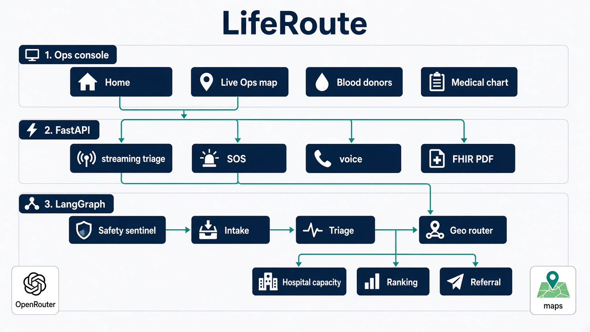
</p>

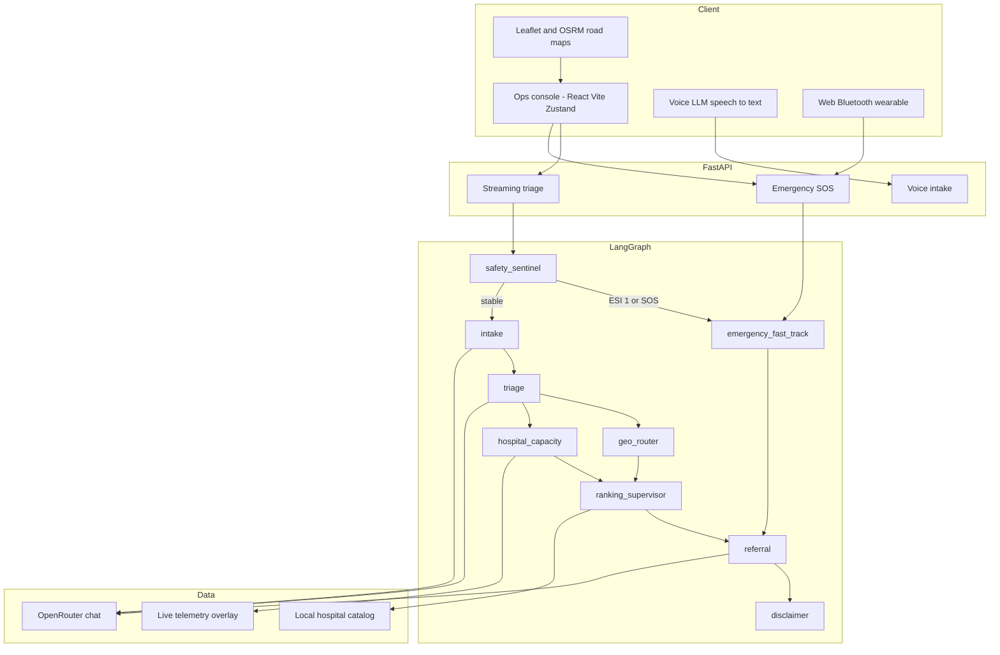

---

## LangGraph pipeline

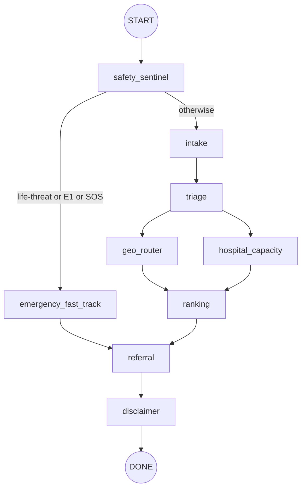

| Node | LLM? | Job |
|------|------|-----|
| `safety_sentinel` | No | Scan language in &lt;20ms. Honour user ESI. Route E1 → fast-track |
| `emergency_fast_track` | Minimal | Trauma ER + ALS + 108 path |
| `intake` | Yes | Language, chief complaint, structured symptoms |
| `triage` | Rules first | ESI 1–5. User override wins. LLM only if stable / low confidence |
| `geo_router` | No | Travel matrix from patient lat/lng |
| `hospital_capacity` | No | Live / mock beds, wait, divert, ICU |
| `ranking` | No | Composite \(S_c\) + rejection reasons |
| `referral` | Yes | FHIR R4 + PDF + QR |
| `disclaimer` | No | Always-on safety copy |

The streaming triage endpoint emits `session`, `sentinel`, `node`, then the final state so the live board can update without a blocking spinner.

---

## ESI and scoring

User-selected stage after the complaint — LifeRoute does **not** auto-promote every chest-pain chip to resuscitation.

| Stage | Label | What happens |
|-------|--------|----------------|
| **E1** | Emergency now | SOS / fast-track, live map, family + 108, ALS |
| **E2** | Emergency | ER + ambulance, live tracking |
| **E3** | Urgent | Hospital ER, no auto-dispatch |
| **E4** | Less urgent | Clinic / OPD |
| **E5** | Non-urgent | Self-care first |

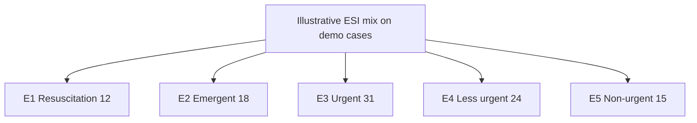

Composite hospital score:

\[
S_c = w_T\,T(\text{travel}) + w_W\,W(\text{wait}) + w_B\,B(\text{beds}) + w_C\,C(\text{specialty}) + w_I\,I(\text{network})
\]

| Weight | Default | ESI 1–2 |
|--------|---------|---------|
| Travel | 0.28 | 0.35 |
| ER wait | 0.18 | **0** (wait is irrelevant) |
| Beds | 0.16 | 0.10 |
| Specialty / trauma | 0.28 | **0.50** |
| Network / divert | 0.10 | 0.05 |

```
Specialty / trauma   ██████████████████████████████  0.50   ESI-1
Travel               █████████████████████           0.35
Beds                 ██████                          0.10
Network              ███                             0.05
Wait                 ·                               0.00
```

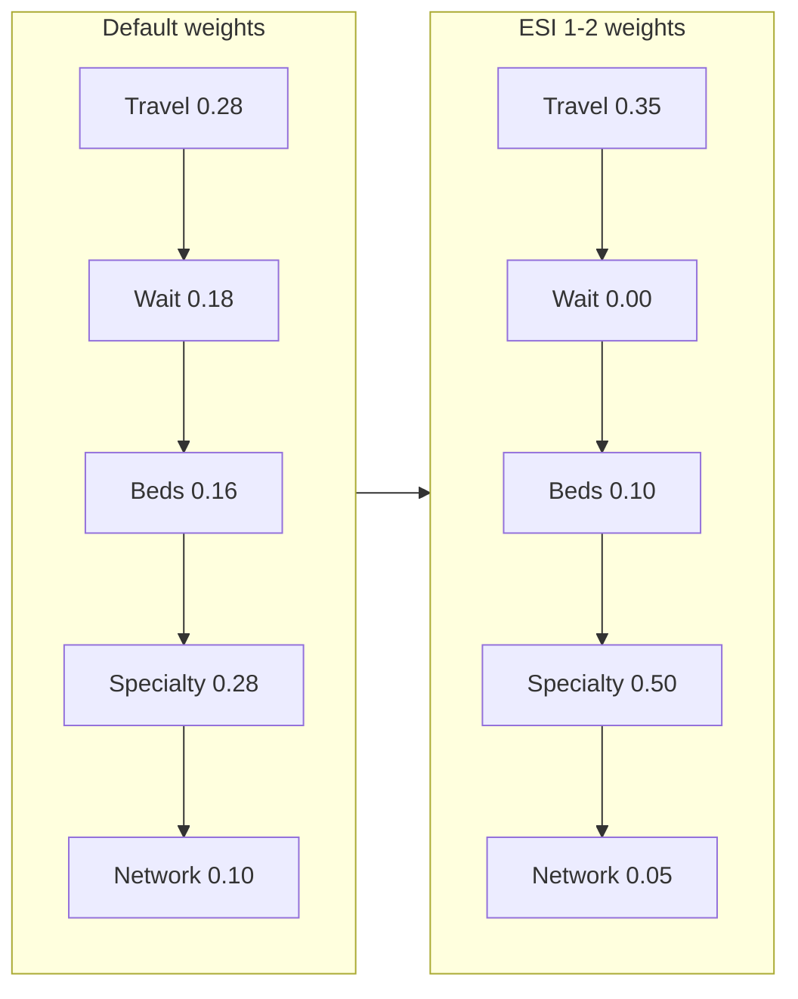

Capability boosts (examples): chest/cardiac → cath lab; stroke → neurology; trauma → trauma centre; child → pediatric.

---

## Live operations

Opening **E1 / E2** (or SOS / wearable alert) lands on the live incident board — not a stack of equal cards.

<p align="center">
  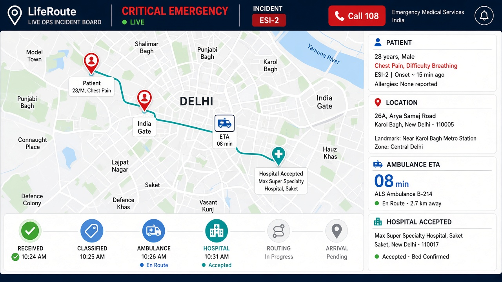
</p>

```
┌────────────────────────────────────────────────────────────────┐
│ ← Back    CRITICAL EMERGENCY    ● LIVE    ESI-2    [Call 108] │
│ Can't breathe, gasping for air                                 │
├─────────────────────────────────┬──────────────────────────────┤
│                                 │ PATIENT                      │
│         LIVE ROAD MAP           │ Unknown / chart identity     │
│     Patient ●──🚑──→ Hospital   │ LOCATION                     │
│                                 │ AMBULANCE  ETA               │
│                                 │ HOSPITAL   Accepted ✓        │
│                                 │ FACILITY ETA                 │
├─────────────────────────────────┴──────────────────────────────┤
│ Received ✓  Classified ✓  Ambulance ✓  Hospital ✓  Routing ●  │
├──────────────────┬──────────────────────┬──────────────────────┤
│ Ambulance        │ Destination          │ Coordination         │
│ ALS · ETA · km   │ ETA · traffic · ICU  │ 108 + family         │
└──────────────────┴──────────────────────┴──────────────────────┘
```

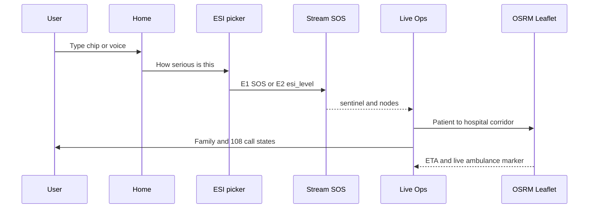

Red is reserved for **critical emergency and SOS**. Progress is a horizontal timeline, not a checklist of equal weight. Coordination (family calling) is supporting, not as large as the map.

---

## Blood and donors

Banks still show live-ish stock. Donors can **register** (name, type, phone, city) and toggle “available for emergency.”

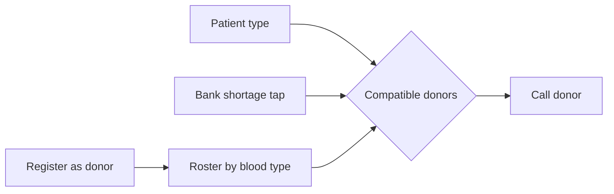

Who can give to whom (study standard ABO/Rh):

```
Donor \ Patient │ O- O+ A- A+ B- B+ AB- AB+
───────────────┼──────────────────────────
O-             │  ✓  ✓  ✓  ✓  ✓  ✓   ✓   ✓
O+             │     ✓     ✓     ✓       ✓
A-             │        ✓  ✓         ✓   ✓
A+             │           ✓             ✓
B-             │              ✓  ✓   ✓   ✓
B+             │                 ✓       ✓
AB-            │                     ✓   ✓
AB+            │                         ✓
```

O− is the universal donor. The Emergency match panel lists only **available** donors who can give to the selected patient type (chart type, active case, or a shortage chip).

---

## LLM and voice

All chat completions go through **OpenRouter**. Voice transcription uses `Voice_LLM` (omni / audio model). Swapping models is an `.env` line.

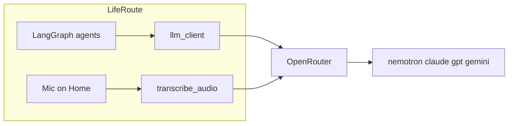

```env
LLM_BASE_URL=https://openrouter.ai/api/v1
LLM_API_KEY=sk-or-v1-...
LLM_MODEL=nvidia/nemotron-3-super-120b-a12b:free
Voice_LLM=nvidia/nemotron-3-nano-omni-30b-a3b-reasoning:free
LLM_APP_NAME=LifeRoute
```

Reasoning models that emit chain-of-thought still parse to JSON. Provider overload maps to a single `LLMError` so agents fall back instead of crashing.

`MOCK_MODE=true` skips live LLM/DB and uses pre-computed Delhi NCR scenarios — same UI.

---

## API

| Method | Path | Purpose |
|--------|------|---------|
| `POST` | `/navigate` | Full pipeline (compat) |
| `POST` | `/api/v2/triage/stream` | SSE triage; `esi_level` honouring |
| `POST` | `/api/v2/triage` | Sync triage |
| `POST` | `/api/v2/emergency/sos` | Fast-track E1 |
| `POST` | `/api/v2/triage/voice` | Audio → transcript |
| `GET` | `/api/v2/hospitals/nearby` | Geo hospitals |
| `POST` | `/api/v2/referral/generate-pdf` | Signed PDF |
| `GET` | `/hospitals` | Network list |
| `POST` | `/assistant/chat` | Connector turn |
| `POST` | `/assistant/invoke` | One tool |
| `GET` | `/assistant/tools` | OpenAI / Anthropic / JSON Schema |
| `GET` | `/health` | Liveness + LLM config |

Interactive docs: `http://localhost:8000/docs`

```json
{
  "input": "I can't breathe, gasping for air",
  "location": { "lat": 28.6139, "lng": 77.2090 },
  "esi_level": 2
}
```

---

## Tech stack

| Layer | Choice | Why |
|-------|--------|-----|
| UI | React 19 + Vite | Fast ops console |
| State | Zustand persist | Chart + donors local, explicit **Save** on profile |
| Maps | Leaflet, Carto roads, public OSRM | Readable patient → ER corridor |
| API | FastAPI + Pydantic | SSE + WebSocket telemetry |
| Agents | LangGraph fan-out DAG | Parallel geo and capacity |
| LLM | OpenRouter official SDK | One key, many slugs |
| Clinical | FHIR R4 + ReportLab PDF | Hospital intake, not a blog post |
| Hospitals | Local Delhi NCR catalog | Nearby, specialty, and capacity without a remote DB |
| Tests | pytest | Sentinel, vitals, scorer, FHIR, pipeline |

---

## Project structure

```
hack/
├── README.md
├── .env.example
├── backend/
│   ├── main.py
│   ├── api/v2/router.py          streaming, SOS, voice, nearby, PDF
│   ├── graph/
│   │   ├── pipeline.py           sentinel → fan-out DAG
│   │   ├── scoring.py            five-factor hospital score
│   │   ├── llm_client.py         chat + Voice_LLM transcribe
│   │   └── agents/               sentinel, fast_track, intake, triage,
│   │                             geo_router, hospital_capacity, ranking,
│   │                             referral, vitals_validator, disclaimer
│   ├── fhir/serializers.py
│   ├── services/pdf_referral.py
│   ├── assistant/                tool connector
│   └── db/                       local hospital catalog
└── frontend/src/
    ├── pages/LifeRoutePage.jsx
    ├── features/
    │   ├── ops/                  Home + Live Ops
    │   ├── emergency/            Track board + takeover
    │   ├── maps/                 road / satellite + OSRM
    │   ├── hospitals/            nearby, ambulance, blood+donors, ICU
    │   ├── profile/              medical chart + Save
    │   ├── wearable/             Bluetooth connect / dispatch
    │   └── layout/AppShell.jsx
    └── stores/                   profile, donors, session
```

---

## Quick start

| Requirement | Version |
|-------------|---------|
| Python | ≥ 3.12 |
| Node.js | ≥ 18 |
| OpenRouter key | [openrouter.ai/keys](https://openrouter.ai/keys) |

```bash
git clone <this-repo>
cd hack
cp .env.example .env
```

Fill `LLM_API_KEY`, `LLM_MODEL`, optional `Voice_LLM`, `MOCK_MODE`.

```bash
# API
cd backend
python -m venv .venv
.venv\Scripts\activate          # Windows
# source .venv/bin/activate     # macOS / Linux
pip install -r requirements.txt
uvicorn main:app --reload --host 127.0.0.1 --port 8000

# UI
cd ../frontend
npm install
npm run dev -- --host 127.0.0.1 --port 5173
```

Open [http://127.0.0.1:5173](http://127.0.0.1:5173).

```bash
curl.exe http://127.0.0.1:8000/health
curl.exe -X POST http://127.0.0.1:8000/api/v2/emergency/sos ^
  -H "Content-Type: application/json" ^
  -d "{\"input\":\"unconscious not breathing\",\"location\":{\"lat\":28.6139,\"lng\":77.209}}"
```

Demo prompts: *severe chest pain and difficulty breathing* · *मुझे तेज़ बुखार और सिरदर्द है* · *Road accident, head injury, bleeding*. Pick E1–E5; E1/E2 open Live Ops.

---

## Safety

- Navigation aid, **not** a diagnostic device and **not** a replacement for 108.
- Sentinel runs **before** generative models on life-threat language.
- User ESI is honoured so the product does not invent resuscitation.
- Disclaimer node always attaches.
- Profile **Save** is required so unsaved drafts never silently change dispatch.
- Red in the UI is SOS / critical only.

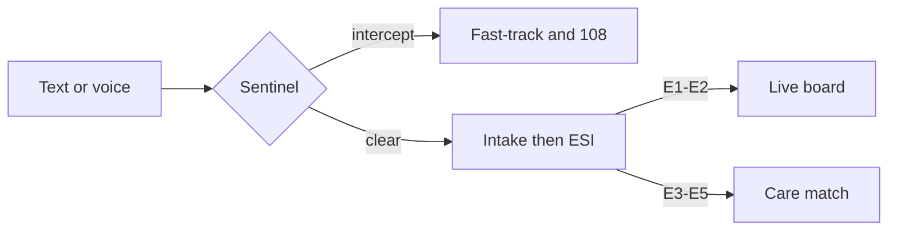
