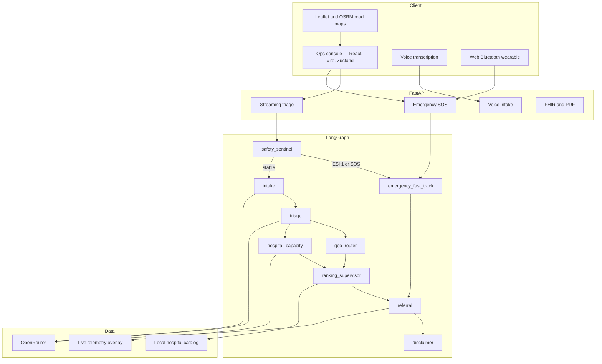
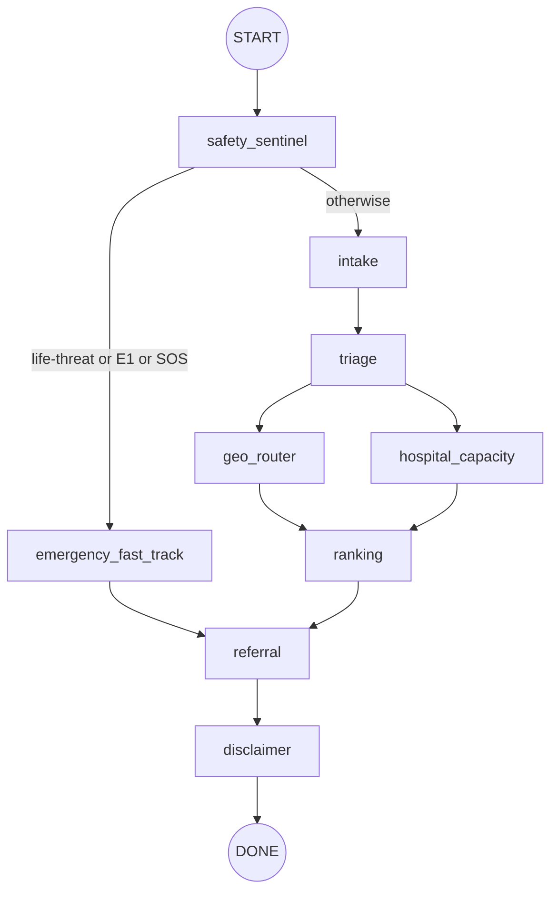

# Architecture

LifeRoute is a React ops console plus a FastAPI service that runs a **LangGraph** pipeline. Hospital matching, travel, and capacity stay deterministic. The LLM is used for intake wording, some triage when rules are unsure, and referral text — never as the first safety gate.

## Layers

## Client

| Piece | Role |
|-------|------|
| `frontend/src/pages/LifeRoutePage.jsx` | Shell: tabs, ESI ask, SOS, wearable, live track |
| `features/ops` | Home + live command |
| `features/emergency` | Incident board and takeover |
| `features/maps` | Leaflet, Carto roads, public OSRM corridor |
| `features/hospitals` | Nearby, ambulance, blood + donors, ICU |
| `features/profile` | Medical chart with explicit Save |
| `features/wearable` | Web Bluetooth; critical vitals can trigger SOS |
| Zustand stores | Session, profile (persist), donors (persist) |

The chart and donor roster persist in the browser. Triage session state lives in `useLifeRouteStore` for the open case.

## API

`backend/main.py` mounts:

- Compat routes: `/navigate`, `/health`, `/hospitals`, `/assistant/*`
- Versioned clinical router twice: `/api/v2` and `/v2` (Vite rewrites `/api` → backend root, so `/api/v2/...` becomes `/v2/...`)

See [API](API.md) for each path.

## LangGraph pipeline

Built in `backend/graph/pipeline.py`.

| Node | LLM? | Job |
|------|------|-----|
| `safety_sentinel` | No | Scan EN/Hindi red-flag language in process, under ~20ms. Honour user ESI. Send E1 / SOS to fast-track |
| `emergency_fast_track` | Minimal | Trauma-capable ER + ALS + 108 path |
| `intake` | Yes | Language, chief complaint, structured symptoms |
| `triage` | Rules first | ESI 1–5. User override wins. LLM only if stable / low confidence |
| `geo_router` | No | Travel matrix from patient lat/lng |
| `hospital_capacity` | No | Beds, wait, divert, ICU (live overlay or mock) |
| `ranking` | No | Composite score + rejection reasons |
| `referral` | Yes | FHIR R4 bundle + PDF + QR |
| `disclaimer` | No | Always-on safety copy |

`POST /api/v2/triage/stream` emits `session`, `sentinel`, then each node so the live board can update without a blocking spinner.

`run_pipeline` persists a session and an audit row when the graph finishes. `MOCK_MODE=true` (or a hard failure) can return a pre-computed Delhi NCR scenario so the UI still has a complete case.

## Hospitals and telemetry

Facilities come from the **local catalog** (`backend/db`, `graph/mock_data.py`) for Noida / Gurugram / Delhi NCR — not a remote hospital SaaS. Capacity and ambulance fields are enriched and can be overlaid with simulated live telemetry so the ops board looks current.

Maps: Leaflet for the board; **OSRM** public routing for the patient → hospital polyline. If OSRM is unreachable, the client falls back to a geodesic path.

## LLM gateway

All completions go through **OpenRouter** (`backend/graph/llm_client.py`). One key, many slugs. Voice uses `Voice_LLM`. Provider overload becomes `LLMError` so agents fall back instead of crashing the request.

Keys stay on the server. The browser never sends `LLM_API_KEY`.

## Why fan-out

Geo and capacity do not depend on each other. Running them in parallel after triage shortens time-to-rank on the live board. Ranking waits for both, then referral and disclaimer always run.
