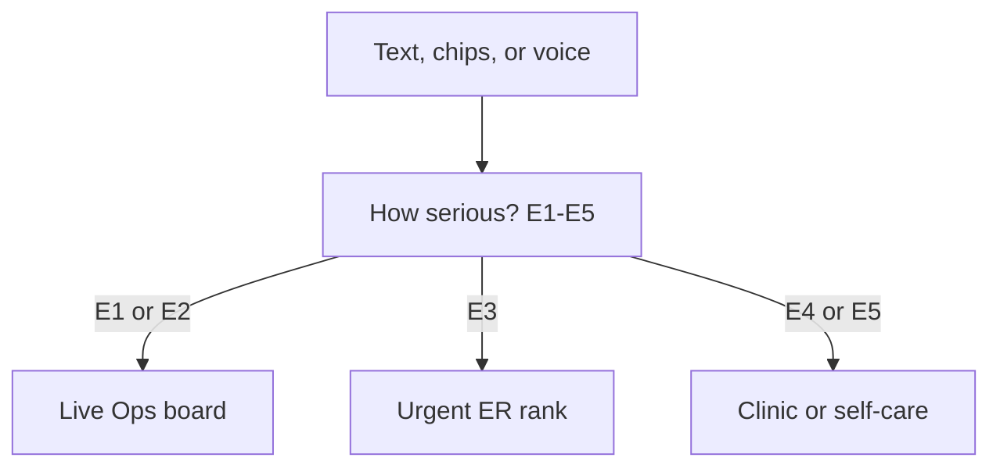
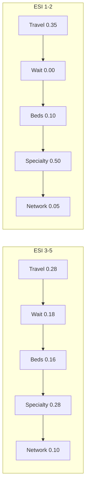

# ESI and scoring

LifeRoute does **not** auto-promote every serious-sounding chip to resuscitation. After the complaint, the person picks **how serious this is**. That stage changes routing, weights, and whether Live Ops opens.

## ESI stages

| Stage | Label | What happens |
|-------|--------|----------------|
| **E1** | Emergency now | SOS / fast-track, live map, family + 108, ALS |
| **E2** | Emergency | ER + ambulance, live tracking |
| **E3** | Urgent | Hospital ER match, no auto-dispatch |
| **E4** | Less urgent | Clinic / OPD |
| **E5** | Non-urgent | Self-care first |

User-selected ESI is written onto pipeline state (`user_esi_level`) and **wins** over a model guess. The sentinel can still force the emergency path when language is a clear life threat (unconscious, not breathing, STEMI language, and similar).

## Composite hospital score

Implemented in `backend/graph/scoring.py`.

\[
S_c = w_T\,T(\text{travel}) + w_W\,W(\text{wait}) + w_B\,B(\text{beds}) + w_C\,C(\text{specialty}) + w_I\,I(\text{network})
\]

Each factor is 0–100 (higher is better), then weighted.

| Factor | How it is scored |
|--------|------------------|
| **Travel** \(T\) | Exponential decay: 0 minutes → 100, about 45 minutes → ~37. Missing travel uses ~3.2 min/km |
| **Wait** \(W\) | Exponential decay of ER wait. For ESI 1–2 wait is treated as 100 (weight is also 0) |
| **Beds** \(B\) | Occupancy + available beds. **Divert** → 0 |
| **Specialty** \(C\) | Complaint keywords vs cath lab, neuro, trauma, pediatric, ICU. ESI 1–2 penalize a missing capability |
| **Network** \(I\) | In-network vs out. For ESI 1–2 network is de-emphasised |

### Default weights (ESI 3–5)

| Weight | Value |
|--------|-------|
| Travel | 0.28 |
| ER wait | 0.18 |
| Beds | 0.16 |
| Specialty / trauma | 0.28 |
| Network / divert | 0.10 |

### Resuscitation weights (ESI 1–2)

| Weight | Value | Why |
|--------|-------|-----|
| Travel | 0.35 | Minutes to a capable door |
| ER wait | **0** | Queue time must not beat a trauma or cath-lab hospital |
| Beds | 0.10 | Still avoid divert |
| Specialty / trauma | **0.50** | Capability first |
| Network / divert | 0.05 | Insurance network is not the decision |

## Capability examples

| Complaint cues | Prefer |
|----------------|--------|
| Chest / heart / cardiac / STEMI | Cath lab + ICU |
| Stroke / paralysis / facial droop | Neurology unit + ICU |
| Trauma / accident / bleed | Trauma centre + ICU |
| Child / pediatric | Pediatric specialty |
| Breath | ICU |

`rank_hospitals` sorts by `composite_match_score` and returns the top matches (default three for ranking, nearby API uses a larger list).

## Live Ops timing

On the incident board, progress stages (Received → Classified → Ambulance → Hospital → Routing → Arrival) advance on a short clock so the route is drawn when Routing starts, instead of appearing already finished. That is presentation of a prepared case, not a claim that a unit was dispatched.
