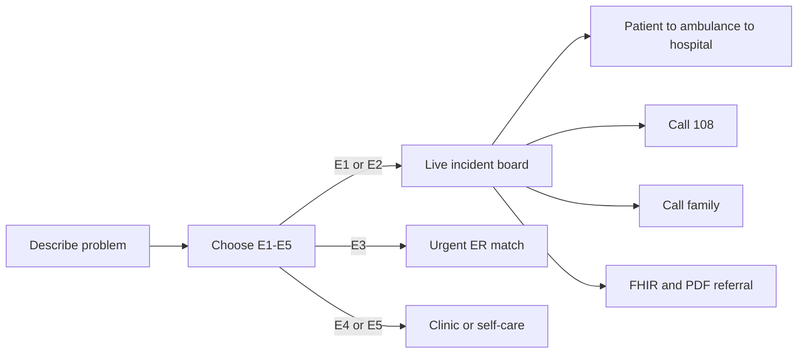

# Product

## The problem

Golden-hour care is often lost because the **wrong door** is chosen first — not because no hospital exists.

Typical failure:

1. Someone searches “nearest hospital.”
2. They arrive at a packed ER that has no ICU, cath lab, or trauma bay.
3. The patient is transferred again.
4. Time that mattered is already gone.

Other gaps: severity is guessed instead of chosen, family is not called, blood and ambulance are planned after arrival, and the medical chart stays in a PDF at home.

## What LifeRoute is

LifeRoute is one ops console for **Delhi NCR emergency navigation**:

- Describe the problem in text, chips, or voice (English or Hindi).
- Choose **how serious it is** (ESI E1–E5). The stage decides the path.
- A **safety sentinel** scans life-threat language before any LLM call.
- Hospitals are ranked by travel, wait, beds, specialty, and network — not by nearest pin alone.
- **E1 / E2** (or SOS / wearable alert) open the **live incident board**: road map, unit, destination, 108, family.
- The **medical chart** (name, blood type, contacts, allergies, vitals) rides every triage pass after **Save**.
- Blood banks plus a **donor registry** can match compatible, available donors.
- Output includes a **FHIR R4** bundle and a signed **PDF referral** with QR.

## Who it is for

| Audience | How they use it |
|----------|-----------------|
| Family or bystander | Type or speak what is happening, pick ESI, call 108 and family from the board |
| Ops / care coordinator | Watch map, ETA, hospital acceptance, ALS/BLS, ICU, blood |
| Clinician at the receiving door | FHIR bundle + PDF so history is not only verbal |

It is **not** a consumer chat companion and **not** a replacement for calling 108.

## Product map

The app is a single shell (`LifeRoutePage`) with these surfaces:

| Surface | What you see |
|---------|----------------|
| **Home** | “How can we help?” intake, voice, ESI picker, readiness (chart gaps, nearest hospital, ALS, family) |
| **Live Ops** | Incident board: map ~70%, summary, progress, ambulance, destination, 108 |
| **Hospitals** | Nearby capable facilities |
| **Ambulance** | ALS / BLS units with live-looking telemetry |
| **Blood** | Bank stock, donor register, emergency compatibility match |
| **ICU** | Beds and ventilators |
| **Profile** | Medical chart — changes persist only after **Save** |
| **Settings** | Language and region |

Home **Ready for emergency** is a checklist, not a second nav: missing chart fields, nearest hospital, nearest ALS / Call 108, family contact.

Red in the UI is reserved for **critical emergency and SOS**.

## What LifeRoute does not claim

- It does **not** dispatch an ambulance. The honest action is **call 108**.
- It does **not** diagnose or prescribe.
- User-chosen ESI is honoured so the product does not invent resuscitation from a chip like “chest pain.”
- Hospital matching is a **recommendation**, not a confirmed bed hold.

## Presentation path (judges or a live walkthrough)

1. Open Home. Show the chart is saved (or the missing-field hints).
2. Type or speak a complaint. Pick **E1** or **E2**.
3. Land on Live Ops: map, progress, 108, family.
4. Open Hospitals / Ambulance / Blood / ICU tabs.
5. Open Profile, change a field, **Save**, run intake again so the chart is on the case.
6. Optional: wearable critical vitals → SOS path.

Demo prompts that exercise the pipeline: *severe chest pain and difficulty breathing* · *मुझे तेज़ बुखार और सिरदर्द है* · *Road accident, head injury, bleeding*.
