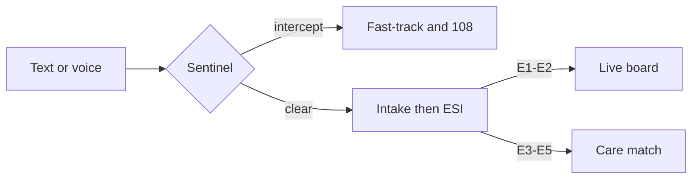

# Safety

LifeRoute is a **navigation aid**. It is not a diagnostic device, not a hospital information system of record, and **not a replacement for 108**.

## Emergency number

All SOS, ambulance, and donor-alert copy uses **108** (India). Do not substitute a European emergency number in product text.

The product must never tell a user that an ambulance **was dispatched**. The honest actions are: call 108, call family, go to the matched door with the referral.

## Safety sentinel

`backend/graph/agents/safety_sentinel.py` runs **in process, before any LLM call**. Budget is under ~20 ms and there is no network I/O.

It scans English and Hindi red-flag language (cardiovascular, stroke, respiratory failure, anaphylaxis, trauma / haemorrhage, obstetric / seizure). A cheap keyword pre-filter avoids running every regex on ordinary clinic text.

User ESI is still honoured: choosing E1 sends the fast-track path even if the sentence is short. Choosing E5 does not hide a sentinel intercept on “unconscious, not breathing.”

## Chart Save

The medical chart (identity, blood type, allergies, medicines, emergency contacts, vitals) is only used when the operator **Saves** it. Unsaved drafts must not silently change who is on the case or who gets called.

Home readiness lists missing fields so a chart can be completed before the next emergency.

## Wearable

Web Bluetooth can stream vitals. Critical readings can open an SOS path and notify family contacts from the chart. That is still a **help request**, not a dispatch confirmation.

## LLM boundaries

- Sentinel and scoring do not need a model.
- Intake / referral text may use OpenRouter; failures become a single error type and agents fall back.
- Do not put API keys in the frontend. `LLM_API_KEY` is server-only.
- Referral and chat output must not invent prescriptions or a confirmed bed.

## Always-on disclaimer

The `disclaimer` graph node always runs. UI copy should stay consistent: guidance only; call 108 if this is an emergency.

## What to test before a live walkthrough

1. E1 / SOS language lands on the live board and shows **Call 108**.
2. No screen says an ambulance was sent.
3. Profile change without Save does not appear on the next case.
4. Hindi complaint still triages (sentinel includes Hindi patterns).
5. `GET /health` does not leak the raw API key.
